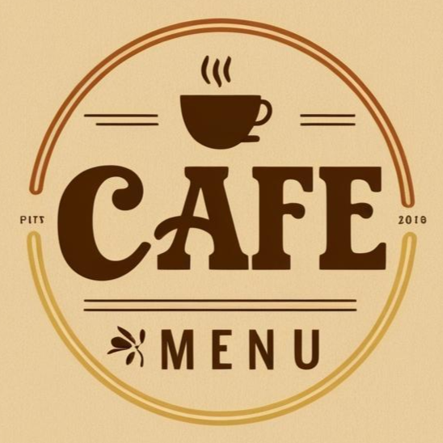

[![Contributors][contributors-shield]][contributors-url]
[![Forks][forks-shield]][forks-url]
[![Stargazers][stars-shield]][stars-url]
[![Issues][issues-shield]][issues-url]
[![project_license][license-shield]][license-url]
[![LinkedIn][linkedin-shield]][linkedin-url]

<!-- PROJECT LOGO -->
<br />
<div align="center">
  <a href="https://github.com/Alanordinola/CafeMenu">
    
  </a>

  
<h3 align="center">Cafe Menu</h3>

<p aling="center">
Learn HTML & CSS while building a stylish coffee shop menu!

<a href="https://github.com/Alanordinola/CafeMenu"><strong>Explore the docs »</strong></a>
    <br />
    <br />
    <a href="https://github.com/Alanordinola/CafeMenu">View Demo</a>
    &middot;
    <a href="https://github.com/Alanordinola/CafeMenu/issues/new?labels=bug&template=bug-report---.md">Report Bug</a>
    &middot;
    <a href="https://github.com/Alanordinola/CafeMenu/issues/new?labels=enhancement&template=feature-request---.md">Request Feature</a>
  </p>
</div>

<!-- TABLE OF CONTENTS -->
<details>
  <summary>Table of Contents</summary>
  <ol>
    <li>
      <a href="#about-the-project">About The Project</a>
      <ul>
        <li><a href="#built-with">Built With</a></li>
      </ul>
    </li>
    <li>
      <a href="#getting-started">Getting Started</a>
      <ul>
        <li><a href="#prerequisites">Prerequisites</a></li>
        <li><a href="#installation">Installation</a></li>
      </ul>
    </li>
    <li><a href="#usage">Usage</a></li>
    <li><a href="#roadmap">Roadmap</a></li>
    <li><a href="#contributing">Contributing</a></li>
    <li><a href="#license">License</a></li>
    <li><a href="#contact">Contact</a></li>
    <li><a href="#acknowledgments">Acknowledgments</a></li>
  </ol>
</details>

<!-- ABOUT THE PROJECT -->
## About The Project

[![Product Name Screen Shot][product-screenshot]](https://example.com)

**Café Menu** is a practical web development exercise created as part of FreeCodeCamp's Responsive Web Design certification. This project helps learners practice:

- Semantic HTML5 structure (sections, articles, headers)
- Modern CSS techniques (Flexbox, variables, hover effects)
- Font integration (Google Fonts + Font Awesome)

**Key learning points:**

- Professional menu layout with clear visual hierarchy  
- Responsive design that works on all devices  
- Interactive elements with smooth transitions  


Designed to teach restaurant/café menu development while reinforcing fundamental web development skills. The clean, commented code makes it perfect for beginners to study and customize.

<p align="right">(<a href="#readme-top">back to top</a>)</p>

### Built With

* [![HTML5][HTML5-shield]][HTML5-url]
* [![CSS3][CSS3-shield]][CSS3-url]
* [![Google Fonts][GoogleFonts-shield]][GoogleFonts-url]
* [![Font Awesome][FontAwesome-shield]][FontAwesome-url]

<p align="right">(<a href="#readme-top">back to top</a>)</p>

<!-- GETTING STARTED -->
## Getting Started

Launch your café menu in minutes! Follow these simple steps to set up the project locally.

### Prerequisites

- Any modern browser (Chrome 110+, Firefox 100+, Edge 110+)
- Git (optional, for version control)
- Code editor (VS Code recommended)

### Installation

1. **Clone the repository:**
   ```sh
   git clone https://github.com/your-username/CafeMenu.git ```

2. **Navigate to project folder:**
```sh
cd CafeMenu
```

3. **Open in browser:**

Double-click index.html or run
```bash

start index.html # Windows
open index.html # macOS
xdg-open index.html # Linux
```

<p align="right">(<a href="#readme-top">back to top</a>)</p>

<!-- USAGE EXAMPLES -->
## Usage

Explore and customize your café menu with these practical examples:

1. **Browse the Menu**  
   Navigate through coffee, desserts, and tea sections in the responsive layout

2. **Edit Content**  
   Replace sample items with your own menu by editing:
   ```html
   <article class="item">
     <div class="item-content">
       <p class="flavor">New Drink <span class="popular-badge">Popular</span></p>
       <p class="price">$4.50</p>
     </div>
     <p class="description">Custom description here</p>
   </article>```

3. **Customize Styles**
Modify colors and fonts in `styles.css:`
```css
:root {
  --primary: #6F4E37;  /* New coffee brown */
  --secondary: #C4A484; /* Light latte color */
}
```

4. **Add New Categories**
Duplicate a `<section class="category">` block for new menu sections

5. **Refresh Browser**
See changes instantly with Live Server or manual refresh  
  
#### Use the built-in hover effects as templates for your interactive elements!

<p align="right">(<a href="#readme-top">back to top</a>)</p>

<!-- ROADMAP -->
## Roadmap

- [ ]  ***Menu Features***
  - [ ]  Seasonal items section
  - [ ]  Dietary tags (Vegan, Gluten-Free)
  - [ ]  Daily specials carousel
- [ ]  ***Technical Improvements***
  - [x]  Responsive design (completed)
  - [ ]  Dark mode toggle
  - [ ]  CSS animations for menu items
  - [ ]  JSON data integration
  
- [ ]  ***User Experience***
  - [ ]  Interactive price calculator
  - [ ]  Menu search functionality
  - [ ]  Language switcher
  
- [ ]  ***Future Possibilities***
  - [ ]  Mobile app version (React Native)
  - [ ]  Online ordering system
  - [ ]  Admin dashboard for menu updates

See the [open issues](https://github.com/Alanordinola/CafeMenu/issues) for a full list of proposed features (and known issues).

<p align="right">(<a href="#readme-top">back to top</a>)</p>


<!-- CONTRIBUTING -->
## Contributing

Contributions are what make the open source community such an amazing place to learn, inspire, and create. Any contributions you make are greatly appreciated.

####  Reporting Issues
Open an [issue](https://github.com/AlanOrdinola/CafeMenu/issues) with:
- `bug` for unexpected behavior
- `enhancement` for feature requests
- `design` for UI/UX improvements

####  Code Contributions
1. Fork the Repository
2. Clone your Fork (`git clone https://github.com/your-username/CafeMenu.git`)

3. Create your Feature Branch (`git checkout -b feature/your-feature`)

4. Commit your Changes (`git commit -m "feat: Add cold brew section"`)

5. Push to your Branch (`git push origin feature/your-feature`)

6. Open a Pull Request

### Top contributors:

<a href="https://github.com/Alanordinola/CafeMenu/graphs/contributors">
  
</a>

<!-- LICENSE -->
## License

Distributed under the project_license. See `LICENSE.txt` for more information.

<p align="right">(<a href="#readme-top">back to top</a>)</p>

<!-- CONTACT -->
## Contact

Alan Ordinola - [Linkedin](https://www.linkedin.com/in/alan-ordinola-10026a196/)

Project Link: [https://github.com/Alanordinola/CafeMenu](https://github.com/Alanordinola/CafeMenu)

<p align="right">(<a href="#readme-top">back to top</a>)</p>

<!-- ACKNOWLEDGMENTS -->
## Acknowledgments

Hecho con ❤️ para el [curso de freeCodeCamp](https://www.freecodecamp.org/learn/2022/responsive-web-design/)  
[](https://www.freecodecamp.org/)

[Best-README-Template](https://github.com/othneildrew/Best-README-Template) - Por la estructura base de este README

<p align="right">(<a href="#readme-top">back to top</a>)</p>


<!-- MARKDOWN LINKS & IMAGES -->
<!-- https://www.markdownguide.org/basic-syntax/#reference-style-links -->
[contributors-shield]: https://img.shields.io/github/contributors/Alanordinola/CafeMenu.svg?style=for-the-badge&color=green
[contributors-url]: https://github.com/Alanordinola/CafeMenu/graphs/contributors
[forks-shield]: https://img.shields.io/github/forks/Alanordinola/CafeMenu.svg?style=for-the-badge&color=blue
[forks-url]: https://github.com/Alanordinola/CafeMenu/network/members
[stars-shield]: https://img.shields.io/github/stars/Alanordinola/CafeMenu.svg?style=for-the-badge&color=yellow
[stars-url]: https://github.com/Alanordinola/CafeMenu/stargazers
[issues-shield]: https://img.shields.io/github/issues/Alanordinola/CafeMenu.svg?style=for-the-badge&color=red
[issues-url]: https://github.com/Alanordinola/CafeMenu/issues
[license-shield]: https://img.shields.io/github/license/Alanordinola/CafeMenu.svg?style=for-the-badge&color=green
[license-url]: https://github.com/Alanordinola/CafeMenu/blob/main/LICENSE.txt
[linkedin-shield]: https://img.shields.io/badge/-LinkedIn-black.svg?style=for-the-badge&logo=linkedin&colorB=0A66C2
[linkedin-url]: https://www.linkedin.com/in/alan-ordinola-10026a196/
[product-screenshot]: images/screenshot.png
[HTML5-shield]: https://img.shields.io/badge/HTML5-E34F26?style=for-the-badge&logo=html5&logoColor=white
[HTML5-url]: https://developer.mozilla.org/en-US/docs/Web/HTML
[CSS3-shield]: https://img.shields.io/badge/CSS3-1572B6?style=for-the-badge&logo=css3&logoColor=white
[CSS3-url]: https://developer.mozilla.org/en-US/docs/Web/CSS
[GoogleFonts-shield]: https://img.shields.io/badge/Google_Fonts-FF5722?style=for-the-badge&logo=google-fonts&logoColor=white
[GoogleFonts-url]: https://fonts.google.com/
[FontAwesome-shield]: https://img.shields.io/badge/Font_Awesome-228B22?style=for-the-badge&logo=font-awesome&logoColor=white
[FontAwesome-url]: https://fontawesome.com/